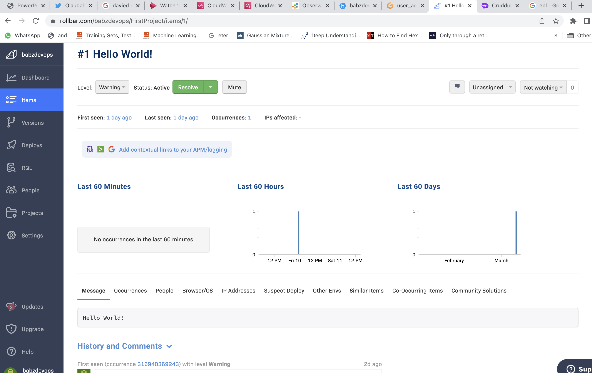

# Week 2 — Distributed Tracing

### Required Homework Task

## Cloud Watch

I Created a cloud watch log group and Loggerd to the cloud API end point

## RollBar.

I Created a Rollbar, added an endpoint and tested to see functionality in Rollbar.

## HoneyComb

I installed the honeycomb telementry dependencies, added the endpoint and tested to see logs in Honeycomb

## AWS Xray Traces

I added Xrat Traces and added a segment and subsegment to the user activities to trace and saw the result of the traces in X-ray Traces.
I would have to go back through most of these done as it is not really easy to comprehend.

